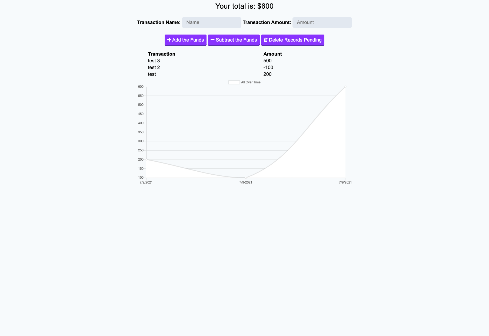

# Budget Tracker 
- Using a progressive web application (PWA) this application enables the user to add expenses and deposits to their budget with or without an online connection. 



## Table of Contents
- [Installation](#installation)
- [Usage](#usage)
- [Contributing](#contributing)

## Installation

To install the required dependencies, run `npm install`

This package assumes there is a MongoDB server running on localhost:27017. If your server is running somewhere else, you can edit `server.js` to reflect that.

## Usage

To start the server, run `npm start`. To access the app after starting the server, go to http://localhost:3000 in your browser.

## Contributing

This project was contributed by myself and the big help from my tutor, Joseph Young. Without him I can install nothing correctly..

### User Story
```
AS AN avid traveler
I WANT to be able to track my withdrawals and deposits with or without a data/internet connection
SO THAT my account balance is accurate when I am traveling 
```

### Acceptance Criteria
```
GIVEN a budget tracker without an internet connection
WHEN the user inputs an expense or deposit
THEN they will receive a notification that they have added an expense or deposit
WHEN the user reestablishes an internet connection
THEN the deposits or expenses added while they were offline are added to their transaction history and their totals are updated
```